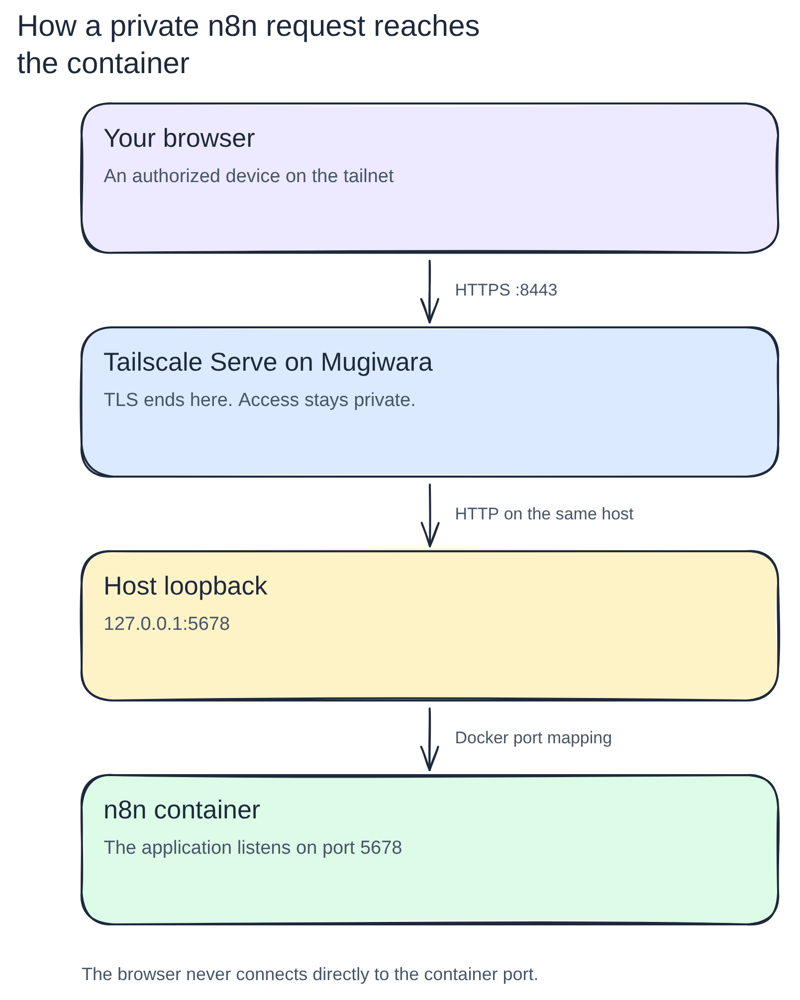
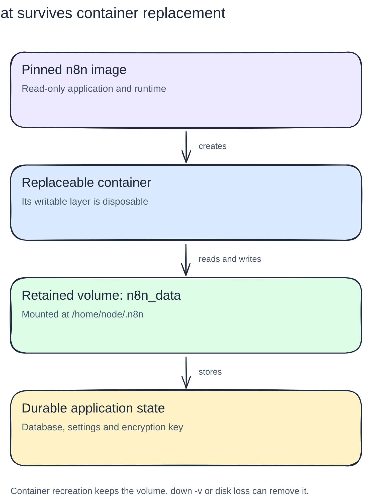

# Docker, Compose and n8n

[Back to the Homelab Handbook](README.md)

A container is replaceable. Its configuration and persistent data should not be.

This chapter uses the configuration in `~/services/n8n/compose.yaml` to explain containers, private networking and persistent storage. The configuration owner is that file, not this chapter. The excerpt documents its non-secret settings; check it before changing the service.

## Open and inspect n8n

- Editor: [private n8n HTTPS](https://mugiwara.tail9aaa00.ts.net:8443/). Your device needs tailnet access.
- Configuration: `~/services/n8n/compose.yaml`.
- Local readiness endpoint: `http://127.0.0.1:5678/healthz/readiness`, accessible on Mugiwara.

The private HTTPS route and configuration are established. Owner-account completion and a successful workflow are separate checks, not implied by a reachable page. If owner setup appears, complete it yourself before using n8n.



[Open the editable Excalidraw source](diagrams/excalidraw/n8n-network.excalidraw).

Tailscale Serve accepts HTTPS on port 8443 and forwards HTTP to host loopback port 5678. Docker maps that port to n8n. `N8N_PROTOCOL=https` describes the external URL; it does not make the container serve TLS.

## The pieces

| Piece | Responsibility |
| --- | --- |
| Docker Engine | Creates containers, networks and volumes on the host. |
| Image | Supplies the application and its packaged runtime. |
| Container | Runs an instance of that image with its own writable layer. |
| Compose | Describes the desired services, ports, environment and storage in YAML. |
| Named volume | Holds persistent files independently of a container. |
| Tailscale Serve | Can provide private HTTPS access to a loopback-bound service. |

An image is not a running application. A container is an instance of an image. Restarting a stopped container preserves its writable layer; removing and replacing it does not preserve that layer. A separately retained volume survives either operation.

A container is also not a Kubernetes node. A node is a machine that runs workloads. Here, Mugiwara is the host and n8n is an application service running in a container.

## Organise service configuration

Keep each independent Compose application in its own directory:

```text
~/services/
├── n8n/
│   └── compose.yaml
├── excalidraw/
│   └── compose.yaml
└── drawio/
    └── compose.yaml
```

This organises host-side configuration. It does not imply that every application needs a data directory or uses the same paths inside its container.

For example, n8n uses `/home/node/.n8n` inside its image. A different application chooses its own storage locations. Excalidraw's basic frontend generally stores drawings in the browser; that is different from server-side persistence and collaboration services.

## Read the Compose file

Read `~/services/n8n/compose.yaml` from the service directory. Its non-secret configuration is:

```yaml
services:
  n8n:
    image: docker.n8n.io/n8nio/n8n@sha256:a8c95f75c6fdf65f5f2b7a7b354744eaa1c62bb911b5c00af6499c3f38e4cd32
    restart: unless-stopped
    ports:
      - "127.0.0.1:5678:5678"
    environment:
      N8N_ENFORCE_SETTINGS_FILE_PERMISSIONS: "true"
      N8N_DIAGNOSTICS_ENABLED: "false"
      N8N_HOST: "mugiwara.tail9aaa00.ts.net"
      N8N_PROTOCOL: "https"
      N8N_EDITOR_BASE_URL: "https://mugiwara.tail9aaa00.ts.net:8443/"
      WEBHOOK_URL: "https://mugiwara.tail9aaa00.ts.net:8443/"
      N8N_PROXY_HOPS: "1"
    volumes:
      - data:/home/node/.n8n

volumes:
  data:
```

### Project name and service directory

There is no top-level `name:` in this configuration. With no `-p` or environment override, Compose takes the project name `n8n` from the directory. The declared `data` volume is then named `n8n_data`.

Keep the project identity stable. Moving the file to a different directory or using `docker compose -p other` can select a different volume. An empty application after such a change does not prove that the original data was deleted.

### `services.n8n`

Names the service inside this project. Commands such as `docker compose logs n8n` refer to this name.

Compose normally creates a project network. Services on that network can discover each other by service name. A single n8n instance does not need a separate database container for this introductory setup; it uses its default SQLite database.

### `image`

Identifies the registry, repository and exact image content. The `@sha256:` value pins the configured image. A tag such as `stable` can move to another release; this digest does not move when that tag changes.

Pulling an image downloads it. Pulling does not by itself replace an already running container. A later recreation may use the newly pulled image, which is why explicit version control matters.

### `restart: unless-stopped`

Asks Docker to restart the container after an exit or daemon restart unless it was explicitly stopped. Docker itself must be enabled and running for this to help.

This does not provide a backup, repair a broken configuration or replace health monitoring.

### `127.0.0.1:5678:5678`

The three parts mean:

```text
host bind address : host port : container port
127.0.0.1         : 5678      : 5678
```

The request diagram shows why the host port stays private even though your browser reaches the editor. Loopback is not a LAN listener. Tailscale Serve forwards the request locally; other host processes can also reach this port. Keep n8n authentication enabled.

Omitting the address, as in `5678:5678`, normally publishes on all host interfaces. That is not the intended configuration here.

### Environment settings

`N8N_ENFORCE_SETTINGS_FILE_PERMISSIONS` asks n8n to enforce restrictive permissions on its settings file. `N8N_DIAGNOSTICS_ENABLED=false` disables n8n diagnostics telemetry; it does not make the application offline or replace access controls.

Quoted values are strings. The URL settings tell n8n what users and webhook callers see:

| Setting | Why it is here |
| --- | --- |
| `N8N_HOST` | The external hostname, without a scheme or port. |
| `N8N_PROTOCOL` | The external scheme is HTTPS even though Serve uses HTTP upstream. |
| `N8N_EDITOR_BASE_URL` | The browser editor URL, including the external port `8443`. |
| `WEBHOOK_URL` | The base URL n8n advertises for webhooks. This value is private, so internet services cannot generally call it. |
| `N8N_PROXY_HOPS` | Trust one reverse-proxy hop, Tailscale Serve. Reassess if another proxy is added. |

These settings do not disable authentication or secure cookies. Do not expose setup or change HTTPS settings just to bypass a browser problem.

### `data:/home/node/.n8n`



[Open the editable Excalidraw source](diagrams/excalidraw/container-volume.excalidraw).

`data` names the volume; `/home/node/.n8n` is its mount point inside the container. The image supplies the application. The volume holds data that must outlive that application instance.

In this default single-instance setup, that directory contains n8n's SQLite database and settings, including its generated encryption key. Preserve the database and encryption key together; a database backup alone may not let you recover saved credentials.

`node` is the image's application user. It is not a shared home directory for all services, and the dot in `.n8n` simply denotes a hidden directory by Unix convention.

The top-level `volumes: data:` declaration tells Compose to manage this named volume. It is not the same as a host folder called `./data`.

## Tags versus digest pinning

A tag is a label that can move. A digest identifies image content.

From the directory containing the Compose file:

```bash
cd ~/services/n8n
docker compose config --quiet
docker compose pull
```

`config --quiet` validates the Compose model without starting containers or printing the expanded configuration. No output and exit status zero mean validation succeeded. `pull` downloads the image selected in the current file. With a digest pin, it does not choose a newer release.

For a deliberate upgrade, first review the desired release. Pull that chosen tag, then inspect its digest. This example uses the movable `stable` tag; it is not the current pinned configuration:

```bash
docker pull docker.n8n.io/n8nio/n8n:stable
```

Find the digest of the image you just downloaded:

```bash
docker image inspect docker.n8n.io/n8nio/n8n:stable \
  --format '{{index .RepoDigests 0}}'
```

Copy the complete returned value into `image:`. Its shape is:

```yaml
image: docker.n8n.io/n8nio/n8n@sha256:THE_ACTUAL_DIGEST
```

`THE_ACTUAL_DIGEST` is a placeholder, not a usable value. Do not invent or copy a digest from a different image.

The registry may return a digest for a multi-platform image index. Docker still selects a compatible platform. A digest does not make an unsupported CPU architecture supported.

Pinning makes updates deliberate and identifies the previous image for rollback. It does not prove the publisher is trustworthy, eliminate vulnerabilities or make database migrations reversible. You still need a patching process.

## Where the data lives

After Compose has created the volume:

```bash
docker volume ls
docker volume inspect n8n_data --format '{{ .Mountpoint }}'
```

For a conventional rootful Linux Docker installation, the result is often:

```text
/var/lib/docker/volumes/n8n_data/_data
```

Use inspection rather than assuming that path. Docker's data root can be configured, and rootless installations use different locations.

Docker manages the directory and its permissions. Do not modify a live SQLite database directly there. Inspecting volume metadata is different from editing application files.

### Named volume or bind mount?

| Choice | Compose example | Useful when |
| --- | --- | --- |
| Named volume | `data:/home/node/.n8n` | The application owns its database and settings. |
| Bind mount | `./data:/home/node/.n8n` | You deliberately manage the host path and its permissions. |

Neither is inherently more advanced. Named volumes reduce host-path coupling. Bind mounts make the host location explicit, which is useful for configuration, scripts and media, but you must manage ownership and permissions yourself.

Both need backups. Neither survives physical disk loss without another copy elsewhere.

## Operating the service

Once the image is pinned and the intended private access is prepared:

```bash
docker compose up -d
docker compose ps
docker compose logs --tail 50 n8n
```

- `up` creates or reconciles resources; `-d` means detached, so the terminal returns while the container runs. Docker may replace a container when its configuration changes.
- `ps` shows current container status. A running container is not proof that the application is ready.
- `logs --tail 50 n8n` selects the n8n service and limits the initial output to its last 50 lines. Logs can contain operational or workflow data; inspect them carefully before sharing.

A host-side readiness check for n8n is:

```bash
curl --fail --silent --show-error http://127.0.0.1:5678/healthz/readiness
```

A successful readiness response does not verify login, HTTPS, workflows or webhooks. Check those separately.

| Command | Effect |
| --- | --- |
| `docker compose stop` | Stops containers, retaining containers and volumes. |
| `docker compose start` | Starts existing stopped containers. |
| `docker compose down` | Removes the project's containers and networks; retains named volumes by default. |
| `docker compose down -v` | Also removes declared non-external named volumes and attached anonymous volumes. Destructive. |

Avoid `down -v` when you want to retain n8n data. Do not use global prune commands as routine service maintenance without checking their scope.

## Private editor, public integrations

The request diagram above describes the private editor route. Both editor and webhook URLs currently use that same private endpoint. A public integration needs a separate access decision; setting `WEBHOOK_URL` alone does not make a private service public.

Some external services need to call n8n. A private editor can coexist with a separate public webhook hostname through Cloudflare Tunnel and an explicitly restricted proxy. Configure the public webhook URL separately from the editor URL.

Do not expose the whole editor or management API merely to receive one webhook. Start with no public routes, add only the production endpoints required, and verify signatures or authentication appropriate to each integration. Test webhooks and some OAuth callbacks have different paths and need deliberate decisions.

## Troubleshooting

### Docker says permission denied

The client is installed, but the process cannot access the daemon socket. Check:

```bash
id -nG
ls -l /var/run/docker.sock
```

Adding an account to the `docker` group changes future login sessions, not the groups of an already running terminal or app-server. Reconnect and restart the process that launches Docker commands.

Membership in the Docker group is effectively root-level access on a conventional rootful installation. It is not a minor convenience permission.

### `docker compose` is unknown

Docker Engine and the Compose CLI plugin are separate components. A user-local plugin can live at `~/.docker/cli-plugins/docker-compose`; a system-managed package is another option. User-local copies do not automatically receive apt updates.

Verify discovery with:

```bash
docker compose version
```

### The volume does not exist

Writing YAML or pulling an image does not create the volume. Check whether `up` has created the project and whether the project name is what you expect. Do not create a new empty volume over a suspected naming mistake before locating the original data.

### The service works locally but not from another machine

A loopback bind intentionally prevents direct remote access. Verify local readiness first, then the Tailscale proxy and its HTTPS URL. Do not change the bind address to `0.0.0.0` as an unexplained workaround.

### The application starts with empty data

Check the project name and mounted volume before making any changes. A different project name, Docker context or volume mapping can select a new empty volume even though the old one still exists.

## Backups and upgrades

Before storing valuable workflows or credentials, establish a tested backup procedure. For this SQLite setup, a simple maintenance procedure stops n8n, backs up the complete persistent directory to separate storage, restarts it and verifies recovery. A raw copy of a live database is not automatically consistent.

An upgrade should have:

1. A recorded current image digest and configuration.
2. A consistent data backup, including the encryption key.
3. A reviewed target release and deliberately selected new digest.
4. Readiness, login and representative workflow checks.
5. A recovery plan that accounts for database migrations, not just the old image.

A successful backup command is not a successful restore test. Practise restoration into an isolated instance with external triggers disabled so it cannot duplicate real workflow actions.

## Check your understanding

- Why does replacing a container not delete the named volume?
- What changes if the project name changes?
- Why can a service bound to loopback still be accessed through Tailscale Serve?
- Why is a pinned old image insufficient for every rollback?
- Why must an n8n backup retain both its database and encryption key?

## Further reading

- [Docker Compose services](https://docs.docker.com/reference/compose-file/services/)
- [Docker volumes](https://docs.docker.com/engine/storage/volumes/)
- [Docker bind mounts](https://docs.docker.com/engine/storage/bind-mounts/)
- [n8n Docker installation](https://docs.n8n.io/hosting/installation/docker/)
- [n8n reverse-proxy webhook configuration](https://docs.n8n.io/hosting/configuration/configuration-examples/webhook-url/)
- [Tailscale Serve](https://tailscale.com/kb/1312/serve)
