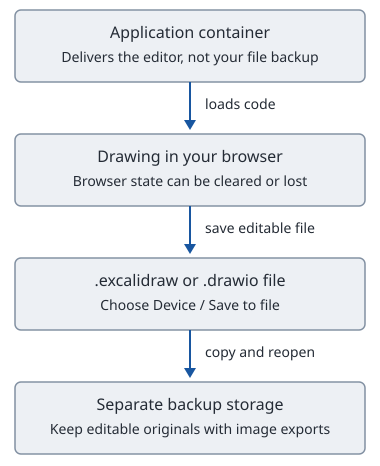

# Excalidraw and draw.io

[Back to the Homelab Handbook](README.md)

Use Excalidraw to sketch a system while working out how it fits together. Use draw.io when you need aligned shapes, connectors and a more structured diagram. Both run in your browser. Hosting the editor yourself does not move your drawings into a backed-up server folder.

| Choose | For example | Keep the editable original |
| --- | --- | --- |
| Excalidraw | Sketch the route from your laptop through Tailscale to a container. | `.excalidraw`, a JSON drawing file. |
| draw.io | Maintain a network diagram with named ports, boundaries and aligned components. | `.drawio`, the editable diagram file. |



A browser session is a working copy. Save an editable file, copy it to separate storage, then reopen it to check that the drawing survived. Export SVG or PNG for readers who only need to view it.

## Open the editors

| Application | Private URL | Configuration owner | HTTP mapping on Mugiwara |
| --- | --- | --- | --- |
| Excalidraw | [Open Excalidraw](https://mugiwara.tail9aaa00.ts.net:8444/) | `~/services/excalidraw/compose.yaml` | `127.0.0.1:8081` to container port `80` |
| draw.io | [Open draw.io with cloud storage disabled](https://mugiwara.tail9aaa00.ts.net:8445/?offline=1) | `~/services/drawio/compose.yaml` | `127.0.0.1:8082` to container port `8080` |

These are deployed private endpoints, not proposed URLs. Tailscale Serve accepts HTTPS on 8444 or 8445 and forwards HTTP to the corresponding loopback port, following the same pattern as [n8n](docker-and-n8n.md). Your device needs authorized tailnet access; Mugiwara must be awake and connected. There is no expiry.

The deployment checks established certificate-verified HTML and sampled JavaScript/CSS responses. Excalidraw reported healthy. draw.io responded over HTTP but did not have an observed Docker healthcheck. Drawing, saving, reopening and another-device access still need browser checks. An HTTP 200 response is not proof that those interactions work.

## Read the Compose files

Each service has its own directory and Compose project. There is no top-level `name:` override, so the directory supplies the project name unless a command or environment variable overrides it.

`~/services/excalidraw/compose.yaml`:

```yaml
services:
  excalidraw:
    image: excalidraw/excalidraw@sha256:f7ee194addd607bf831d2af0f0a34463dd4225e426cf35199ef0b12a803398e9
    restart: unless-stopped
    ports:
      - "127.0.0.1:8081:80"
```

`~/services/drawio/compose.yaml`:

```yaml
services:
  drawio:
    image: jgraph/drawio@sha256:a2c1de83dae975d44eb4ff4ccaa4f2d9f954c4915c767b000bc78909ae4e4dff
    restart: unless-stopped
    ports:
      - "127.0.0.1:8082:8080"
    environment:
      DRAWIO_SERVER_URL: "https://mugiwara.tail9aaa00.ts.net:8445/"
```

The service files own the configuration. These excerpts explain their non-secret settings; compare them with the files before making a change.

| Setting | Meaning and reason |
| --- | --- |
| `services.excalidraw` or `services.drawio` | Names the service for commands such as `docker compose logs drawio`. Each project gets its own default network. |
| `image: repository@sha256:…` | Pins exact image content. Pulling the same digest does not select a new release. |
| `restart: unless-stopped` | Restarts the container after an exit or Docker restart unless you deliberately stopped it. Docker must also be running. This is not a healthcheck or a backup. |
| `127.0.0.1:8081:80` | Publishes host loopback port 8081 to Excalidraw's container port 80. Leaving out `127.0.0.1` would normally publish on all host interfaces. |
| `127.0.0.1:8082:8080` | Gives draw.io a different host port while retaining its internal port 8080. The ports need not match. |
| `DRAWIO_SERVER_URL` | Tells draw.io its external HTTPS address. Keep the port and trailing slash. TLS terminates at Tailscale Serve, not this HTTP container port. |
| No `volumes:` | Deliberate. These deployments provide editors, not a server-side drawing database. Adding an arbitrary volume does not capture files held in a user's browser. |

The Excalidraw pin came from the official `latest` image, created on 2026-05-06. That is the published image, not a claim that it contains current September source changes. The draw.io pin came from official release `31.4.5`. Treat both as selected versions, not promises of automatic updates.

## Save work before closing the editor

### Excalidraw

1. Use the editor's save-to-file action to keep an editable `.excalidraw` file in a backed-up folder on your device.
2. Export SVG for a scalable diagram or PNG for a bitmap image. Keep the editable file even if an image export can include scene data.
3. Reopen the saved `.excalidraw` file and check its shapes, text and embedded images before relying on it.

Browser-local autosave is convenient but belongs to that browser profile and origin. A different device, private browsing, cleared site data, a changed hostname or a changed port can make it absent. A Docker volume backup on Mugiwara does not contain that browser state.

This deployment has no separate private collaboration or storage backend. The upstream frontend may contact external collaboration, sharing, library or other services. Do not assume a private editor URL means private online sharing, synchronization, application accounts or network isolation. Avoid those online actions for sensitive drawings until their destinations and access rules have been reviewed.

### draw.io

1. Open the link with `?offline=1`. Upstream documents this option as disabling cloud-storage support.
2. Choose Device for a local file, then save the editable `.drawio` file to a backed-up folder. Browser storage, if selected instead, is not a file backup.
3. Use Export as to create SVG or PNG for the handbook. Reopen the editable file to test recovery; merely seeing an exported image does not prove that the source remains editable.

The served configuration disables unconfigured cloud integrations and uses manual synchronization. No cloud-storage connection was set up. Google Drive, OneDrive, GitLab and similar integrations require a separate configuration and authorization decision. Neither `offline=1` nor self-hosting proves that every possible external request is blocked by a network policy.

A separate export-server container is not part of this deployment. Upstream retired `jgraph/export-server`; `EXPORT_URL` is null in the served configuration. Browser-rendered SVG and PNG export remain supported by upstream. PDF export uses the browser print dialog rather than that retired server. These are documented capabilities; the actual export interaction has not been browser-verified here.

### Back up the file, not just the editor

Keep editable originals and any linked assets together. Copy them to storage that survives loss of the drawing device. A downloaded file in Downloads is only one copy. Reopen a backup on another device before considering recovery tested.

Review exports before sharing. Labels, internal addresses and embedded diagram data can reveal more than the visible picture. A PNG or SVG with an embedded editable diagram may carry the source as well as the preview.

## Operate one service at a time

Choose the directory first. Do not run stop or update commands against an unrelated project.

```bash
cd ~/services/excalidraw
# For draw.io instead: cd ~/services/drawio

docker compose config --quiet
docker compose pull
docker compose up -d
docker compose ps
docker compose logs --tail 50
```

| Command or flag | What it does |
| --- | --- |
| `config --quiet` | Validates the resolved Compose model without printing it. Exit status zero means validation passed; no containers start. |
| `pull` | Downloads the image selected in the file. A pinned digest stays pinned. It does not replace a running container by itself. |
| `up -d` | Creates or reconciles the project, then returns to your terminal. `-d` means detached. A changed image or configuration can cause recreation. |
| `ps` | Shows this project's containers and reported state. A running process is not proof that the browser editor works. |
| `logs --tail 50` | Shows only the most recent 50 lines initially. Add a service name to narrow the output. Logs can contain request details, so review them before sharing. |

On Mugiwara, check the local HTTP endpoints without exposing another listener:

```bash
curl --fail --silent --show-error --output /dev/null http://127.0.0.1:8081/
curl --fail --silent --show-error --output /dev/null http://127.0.0.1:8082/
```

`--fail` makes HTTP errors fail the command, `--silent` hides the progress meter, `--show-error` keeps error messages, and `--output /dev/null` discards the page body. Success checks the HTTP response, not drawing behavior. After an update, open the private HTTPS URL, make a disposable drawing, save it and reopen it yourself.

| Intended action | Command and consequence |
| --- | --- |
| Pause this app | `docker compose stop` retains the container. Run `docker compose start` to resume it. |
| Remove this project's containers and network | `docker compose down` removes them. Saved device files are outside this Docker project. |
| Delete declared volumes as well | `docker compose down -v` is destructive. These two projects have no declared data volumes, but n8n does. Never carry this flag into n8n maintenance. |

Stopping a container does not remove its Tailscale proxy. The private link will fail until the application returns. Do not reset all Serve routes to repair one application.

## Upgrade deliberately

First save your drawings and verify a backup. Read the desired upstream release notes and select a release that is actually published as an image. Pull it, inspect the repository digest and update only that app's `image:` value. The [n8n chapter](docker-and-n8n.md) explains the tag-to-digest procedure.

Retain the previous digest and configuration so you can restore the previous editor. After `config --quiet` and `up -d`, check HTTP, then test editing and reopening a disposable file. Do not overwrite your only original file to test whether a new version can read it.

## Troubleshooting

- The editor works on Mugiwara but not your laptop. Check that the laptop is on the tailnet and uses the HTTPS port 8444 or 8445, not the loopback port. Do not change the bind address to `0.0.0.0` as a shortcut.
- The canvas is empty on another device. Look for an exported editable file. Browser-local state does not synchronize simply because both devices load the same server.
- A sharing or cloud button fails. The frontend is not proof of a configured backend or cloud integration. Use local files until the specific integration has been reviewed and tested.
- HTML responds but the editor is blank. Check the app's `ps` and recent logs, then check its JavaScript/CSS requests through the private URL. A cached page alone does not establish readiness.

## Further reading

- [Excalidraw upstream README](https://github.com/excalidraw/excalidraw#readme), including editable-file and image exports. Public Excalidraw.com features are not proof of a private backend here.
- [Official draw.io Docker documentation](https://github.com/jgraph/docker-drawio#readme), including `offline=1`, deployment URLs, integrations and the retired export server.
- [draw.io file formats](https://www.drawio.com/doc/faq/save-file-formats).
- [Docker Compose command reference](https://docs.docker.com/reference/cli/docker/compose/).
