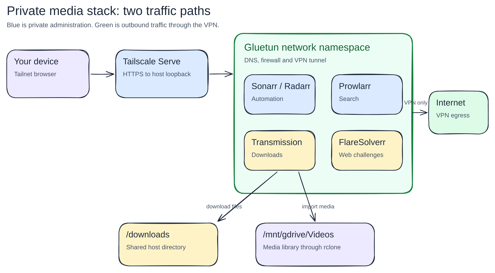

# How the private media stack works

[Back to the Homelab Handbook](README.md)

The media stack is several applications sharing one network boundary. Homarr
helps you find them. Sonarr and Radarr decide what to fetch. Prowlarr supplies
search results. Transmission downloads. Gluetun decides whether any of them
may reach the internet.

This chapter teaches that design through the live Compose project in
`~/services/arr/compose.yaml`. The shorter
[operations runbook](../docker-media-services.md) records versions, paths and
commands. The Compose file owns the deployment. This chapter explains why the
pieces are connected this way.

## Follow one request



[Open the editable Excalidraw source](diagrams/excalidraw/media-stack.excalidraw).

Opening Radarr does not send your browser through the commercial VPN. Your
browser reaches Tailscale Serve over the tailnet. Tailscale terminates HTTPS on
Mugiwara and forwards plain HTTP to `127.0.0.1:7878`.

Radarr's outbound traffic takes a different path. Radarr shares Gluetun's
network namespace, so its DNS queries, indexer requests and calls to external
metadata services use Gluetun's interfaces and firewall. Transmission, Sonarr,
Prowlarr and FlareSolverr share the same boundary.

That distinction matters:

| Traffic | Path | Purpose |
| --- | --- | --- |
| Your browser to Radarr | device, tailnet, Tailscale Serve, loopback port 7878 | Private administration |
| Radarr to Prowlarr | `127.0.0.1:9696` inside the shared namespace | Search and indexer sync |
| Radarr to Transmission | `127.0.0.1:9091` inside the shared namespace | Submit and inspect downloads |
| Applications to the internet | shared namespace, Gluetun firewall, VPN tunnel | Controlled outbound access |

`127.0.0.1` normally means "this container." Here it means the shared Gluetun
network namespace. That is why Radarr can reach Prowlarr on loopback even
though they are separate containers.

## Read the Compose relationship

The repeated setting that creates this design is:

```yaml
network_mode: service:gluetun
depends_on:
  gluetun:
    condition: service_healthy
    restart: true
```

`network_mode: service:gluetun` tells Docker not to create an independent
network namespace for the application. The application uses Gluetun's network
stack. It therefore does not get its own Docker IP address.

The health dependency delays application startup until Gluetun reports a
working tunnel. `restart: true` under this dependency tells Compose to restart
the dependent service when Compose explicitly restarts Gluetun. It does not
turn every transient VPN reconnect into a container restart. Gluetun handles
normal reconnects itself.

Because the namespace belongs to Gluetun, host port mappings also belong to
Gluetun:

```yaml
ports:
  - "127.0.0.1:7878:7878"
  - "127.0.0.1:8989:8989"
  - "127.0.0.1:9091:9091"
  - "127.0.0.1:9696:9696"
```

The left side is the host listener. Binding it to `127.0.0.1` prevents a
direct LAN listener. Tailscale Serve is the intended entry point. The right
side is the port inside the shared namespace.

## What the kill switch actually protects

A VPN connection alone does not prevent fallback traffic. If a tunnel drops
and the normal host route remains usable, an application can leave through the
host's ordinary interface. Gluetun's firewall blocks that route.

The live stack sets `FIREWALL: "on"` and has no broad LAN or Kubernetes subnet
exception. It permits the four local application ports as inbound traffic to
the namespace. Outbound internet traffic must use the tunnel.

This gives the stack one useful failure rule: if the VPN is unavailable,
external requests fail closed. The web interfaces can still be reachable from
the host through their loopback mappings, so you can inspect the failure.

Do not test the kill switch by guessing from a public IP page alone. A sound
test checks both states:

1. With Gluetun healthy, an application container reports the VPN country.
2. Traffic forced through `eth0` fails.
3. After any deliberate stop test, recreate the shared namespace and confirm
   every dependent application returns healthy.

Stopping Gluetun interrupts all five dependent services. Treat that as a
maintenance test, not a casual diagnostic on an active download.

## Storage has two different owners

Application state and media are separate:

| Data | Owner | Why it persists |
| --- | --- | --- |
| `~/services/arr/radarr/`, `sonarr/`, `prowlarr/`, `transmission/` | Host bind mounts | Databases, settings and resume state survive container replacement |
| `/mnt/gdrive/Videos/...` | rclone-mounted media storage | Large media files live outside the application containers |
| `/downloads` | Shared host directory | Transmission writes files that Sonarr and Radarr later import |

The same path must mean the same thing to both sides of an import. Transmission
and the Arr applications all see `/downloads`, so no remote-path translation
is needed. Sonarr and Radarr see the media libraries under `/media`.

The media mount uses group ID 959. Sonarr and Radarr therefore run with user ID
1000 and group ID 959. This is a filesystem decision, not an application role.
If the process can list a directory but cannot create a file, inspect numeric
ownership and mount state before changing application settings.

The Compose bind mounts set `create_host_path: false`. If rclone is missing,
Docker fails instead of creating an empty local directory that looks like a
valid media library. That noisy failure is safer than importing into the wrong
disk path.

## Why Tailscale Serve sits in front

The applications speak HTTP locally. Tailscale Serve supplies private HTTPS
and certificates for tailnet devices. It also lets each service keep a distinct
port without publishing it to the LAN.

Sonarr and Radarr require login and trust forwarded headers only from the
Docker bridge gateway used by host-side Tailscale Serve. The trusted network
setting lets them preserve the original HTTPS scheme in login redirects. It
does not disable authentication.

If Compose recreates its network with a different bridge subnet, a login may
redirect to `http://`. Inspect the current gateway, then update the trusted
network to that one address. Do not trust an entire private address range to
make the redirect work.

## Operate the stack without losing the model

Begin in the directory that owns the Compose project:

```bash
cd ~/services/arr
docker compose config --quiet
docker compose ps
docker compose logs --tail 50 gluetun radarr
```

`config --quiet` validates the resolved model. `ps` tells you which containers
run. Logs show why a process started or failed. None of these proves that an
authenticated browser workflow or an indexer works.

Changing Gluetun replaces the network namespace used by every application.
Reconcile the whole project after such a change:

```bash
docker compose up -d --force-recreate
```

An application-only image update is narrower:

```bash
docker compose up -d radarr
```

The image digest in `compose.yaml` selects the version. Pulling a movable tag
does not update the deployment until its chosen digest is written into the
file and the service is recreated.

## Diagnose from the boundary inward

### The private URL does not open

Check the application container, then its local HTTP port, then Tailscale Serve.
This order separates an application failure from a proxy failure:

```bash
docker compose ps radarr gluetun
curl --fail --silent --show-error http://127.0.0.1:7878/api/v3/system/status
tailscale serve status
```

The API endpoint requires an API key, so an authentication response still
shows that HTTP reached Radarr. Do not put the key in shell history or docs.

### Radarr opens but cannot search

Check Radarr's health page and Prowlarr's application test. Then test the
specific enabled indexer. A successful Prowlarr page load does not prove that
an upstream indexer accepts requests from the current VPN endpoint.

### Searches work but downloads do not start

Run Radarr's Transmission connection test. Both services should use
`127.0.0.1:9091` and `/transmission/`. A Kubernetes service name is stale in
this Docker design because the application no longer uses Kubernetes DNS.

### A completed download will not import

Compare the path reported by Transmission with the path Radarr or Sonarr sees.
Then test read and write access as the application's numeric user and group.
Do not recursively change ownership on the media library until you understand
which mount supplies it.

### Every external request fails

Inspect Gluetun first. This can be the kill switch working as designed. Check
VPN health, recent Gluetun logs and DNS at `127.0.0.1`. Avoid adding a broad
firewall exception because one endpoint is down.

## What the migration taught us

Kubernetes once ran these services with Longhorn volumes and public Cloudflare
routes. The move to Docker kept application databases and paths, then deleted
the old manifests, namespaces and volumes after verification. Docker is now
the only starting state for this stack.

The useful lesson is about ownership. One system should own a running service,
one directory should own its live state, and one document should explain the
design. Parallel "temporary" deployments make later failures harder to reason
about because neither copy is obviously authoritative.

## Check your understanding

You should now be able to answer these without memorising a command:

1. Why do the applications use `127.0.0.1` to reach each other?
2. Why are the host port mappings declared on Gluetun?
3. What happens to outbound traffic when the VPN drops?
4. Why can a missing rclone mount fail container startup?
5. Which state would disappear if you deleted the application data directories?
6. Why does an HTTP response from Radarr prove less than a successful search
   and download-client test?

Use the [operations runbook](../docker-media-services.md) when doing the work.
Return here when you need to reason about why the work is done this way.
